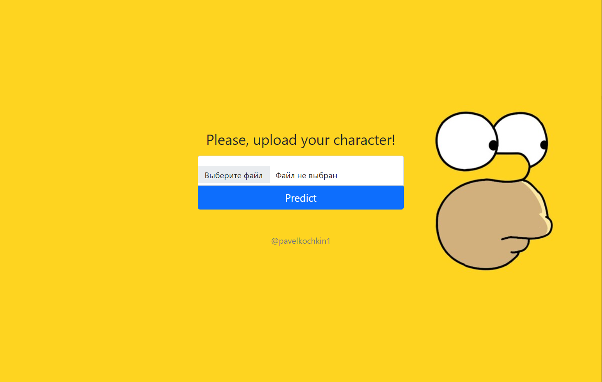
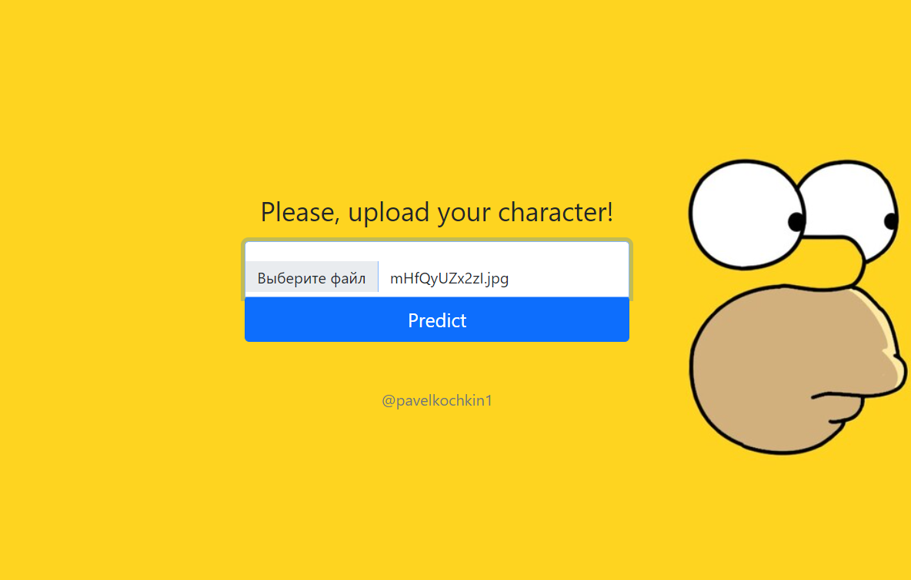
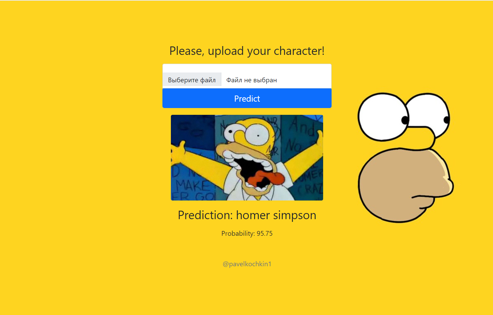

# My research of classification models and deployment of model to [docker](https://www.docker.com/) using [flask](https://flask.palletsprojects.com/en/2.0.x/).

## How to run:
1. Install and run Docker
2. Build Docker image using `docker build . -t simp_server`
3. Run Docker container using `docker run --rm -it -p 8888:8888 simp_server`
4. Go to `http://localhost:8888/` to see all available methods of the API

## Source code
* [simpsons_baseline.ipynb](simpsons_baseline.ipynb) contains my research
* [demo.py](demo.py) contains server logic
* [model/model.py](model/model.py) class of model
* [templates](templates/) and [static](static/) includes html and css files for app
* [Dockerfile](Dockerfile) describes a Docker image that is used to run the app

## Example
1. Run the docker container and open the `http://localhost:8888/`.

2. Upload your image and press `Predict` button.

3. Now we have prediction and probability.

